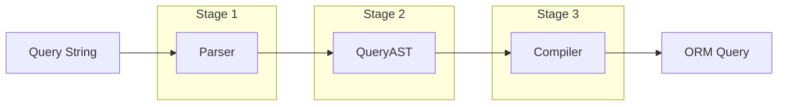

# Architecture

qbjs uses a three-stage pipeline architecture that separates concerns and enables flexibility across different ORMs and databases.

## The Pipeline



## Three Stages

### 1. Parser

The parser transforms raw query strings into a structured Abstract Syntax Tree (AST). It handles:

- Field selection (`fields=id,name,email`)
- Pagination (`page=2&limit=10`)
- Sorting (`sort=createdAt:desc`)
- Filtering (`filter[status][eq]=active`)

The parser is ORM-agnostic and database-agnostic. It only cares about transforming the query string format into a normalized structure.

```typescript
import { parse } from "@qbjs/core";

const result = parse({
  fields: "id,name,email",
  page: "2",
  limit: "10",
  sort: "createdAt:desc",
  filter: { status: { eq: "active" } }
});

// result.ast contains the QueryAST
```

### 2. QueryAST

The AST is the stable contract between the parser and compilers. It's a plain TypeScript object that represents the query in a normalized, type-safe format.

```typescript
interface QueryAST {
  fields: string[] | null;      // Fields to select
  pagination: Pagination;        // Offset and limit
  sort: SortSpec[];             // Sort specifications
  filter: FilterNode | null;    // Filter expression tree
}
```

The AST is:
- **Immutable**: Once created, it doesn't change
- **Serializable**: Can be stored, logged, or transmitted
- **Type-safe**: Full TypeScript support with discriminated unions

### 3. Compiler

Compilers transform the AST into ORM-specific query objects. Each compiler knows how to translate the abstract AST into concrete database operations.

```typescript
import { createDrizzlePgCompiler } from "@qbjs/core";

const compiler = createDrizzlePgCompiler();
const compiled = compiler.compile(result.ast, postsTable);

// compiled.query contains Drizzle-specific query parts
```

## Benefits of This Architecture

### Separation of Concerns

Each stage has a single responsibility:
- Parser: Query string format handling
- AST: Data representation
- Compiler: ORM/database specifics

### Extensibility

Adding support for a new ORM only requires writing a new compiler. The parser and AST remain unchanged.

### Testability

Each stage can be tested independently:
- Test the parser with various query string formats
- Test compilers with known AST inputs
- Validate AST structure with type checking

### Debugging

The AST provides a clear inspection point. You can log the AST to see exactly what the parser understood before it reaches the database.

```typescript
const result = parse(queryInput);
console.log(JSON.stringify(result.ast, null, 2));
// See the exact structure being compiled
```

### Security

Security validation can happen at the AST level, before any database operations. This ensures consistent security regardless of which compiler is used.

## Data Flow Example

Here's a complete example showing data flowing through all three stages:

```typescript
import { parse, createDrizzlePgCompiler } from "@qbjs/core";
import { db } from "./db";
import { posts } from "./schema";

// Stage 1: Parse query string to AST
const queryString = "fields=id,title&filter[status][eq]=published&sort=createdAt:desc&page=1&limit=10";
const { ast, errors, warnings } = parseQueryString(queryString);

if (errors.length > 0) {
  // Handle parse errors
  return { error: "Invalid query" };
}

// Stage 2: AST is now available for inspection/validation
console.log(ast);
// {
//   fields: ["id", "title"],
//   pagination: { offset: 0, limit: 10 },
//   sort: [{ field: "createdAt", direction: "desc" }],
//   filter: { type: "field", field: "status", operator: "eq", value: "published" }
// }

// Stage 3: Compile AST to Drizzle query
const compiler = createDrizzlePgCompiler();
const { query, errors: compileErrors } = compiler.compile(ast, posts);

// Execute the compiled query
const results = await db
  .select(query.columns)
  .from(posts)
  .where(query.where)
  .orderBy(...query.orderBy)
  .limit(query.limit)
  .offset(query.offset);
```

## Next Steps

- Learn about the [QueryAST structure](/docs/core-concepts/query-ast)
- Understand [how the parser works](/docs/core-concepts/parser)
- Explore [available compilers](/docs/core-concepts/compilers)
